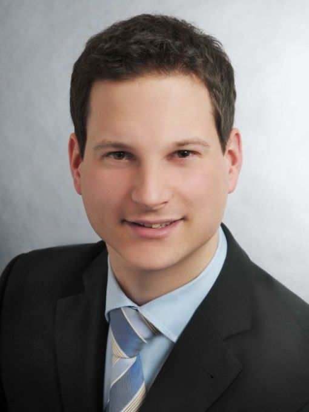

    

        

          
        

        

          Software Engineering 
          Department of Computer Science 3 
          RWTH Aachen University 
          Ahornstraße 55 
          D-52074 Aachen 
           
          +49 (241) 80-21029 
          <a href="mailto:lindt@se-rwth.de">lindt@se-rwth.de</a> 
           
          Raum 9219, Erweiterungsbau 3 
           
          Sprechzeiten nach Vereinbarung
        

    

 



### Research Areas:

- Model Composition and Model Merging
- Domain Driven Modeling using UML Class Models
- Model Reuse and Model Repositories



### Projects:

- ICT Projecthouse: Ontologie-basierte Datenmodellierung von Produkt-, Prozess- und 
Betriebsmittelbeziehungen zur flexiblen Anlagen-Prozess-Rekonfiguration
- WATTALYST: Modeling and Analysing Demand Response Systems (EU-FP7, Grant Agreement 288322)
- Energie-Navigator: A client-/server application for optimizing energy efficiency of public buildings. (BMWi)
- Synavision Community Web Platform
- clArc: Architecture Driven Development of Cloud Software
- MontiArc: An architecture description language and simulation framework.



### Teaching:

- Lab Class - Smart Energy Apps (Winter 2011/2012)
- Seminar - Algorithms in model based Software Development (Winter 2011/2012)
- Seminar - Algorithms in model based Software Development (Winter 2011/2012)
- Lecture - Softwaretechnik (Winter 2013/2014)
- ProSeminar - Best Practices in Software Engineering (Winter 2014/2015)
- Seminar - Selected Topics in Software Engineering (Summer 2015)
- Lecture - Ada95 (Prof. Nagl) (Winter 2015/2016)
- Lecture - Softwaretechnik (Winter 2016/2017)



### Supervised Theses:

- Conception and Development of an Energy Reporting Web Application (Bachelor, 2011)
- Development and Integration of a Statistical Evaluation Framework for a Collaborative Web Platform (Bachelor, 2012)
- Evaluation und Implementierung von Sicherheitsstrategien für Massendaten in Cloud-Umgebungen (Master, 2012)
- Entwicklung einer Zugriffskontrolle für private Daten in verteilten JEE-Applikationen am Beispiel eines Smart-Energy-Projekts, (Master, 2013)
- Strategien für skalierbare Massendatenspeicher (Bachelor, 2013)
- Konzeption und Entwicklung eines Model Repositories für MontiCore (Master, 2015)
- Collaborative Model Management Platform (Master, 2015)
- Implementierung von Strategien zur Verschmelzung von Klassendiagrammen (Bachelor, 2016)
- Entwicklung eines Prozesses zur qualitätsgesicherten Bereitstellung von Modellen in der Plattform Modelpedia (Bachelor, 2016)
- Auswahl und Implementierung von Varianten zur Komposition von UML-Klassendiagrammen (Bachelor, 2016)



### Publications:

  

