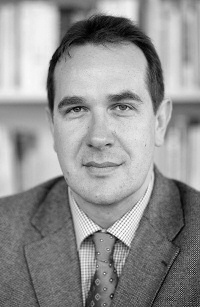

    

        

          
        

        

          Software Engineering 
          Department of Computer Science 3 
          RWTH Aachen University 
          Ahornstraße 55 
          D-52074 Aachen 
           
          +49 (241) 80-21308 
          <a href="mailto:rumpe@se-rwth.de">rumpe@se-rwth.de</a> 
           
          Room 4303
        

    

 


### Teaching:

* Sprechzeiten für studentische Angelegenheiteni: mit dem Sekretariat Termin vereinbaren

* [Anmeldung zu mündlichen Prüfungen: hier](https://www.se-rwth.de/teaching/oral-exams/)

* [Master- and Bachelor-Theses: here](https://www.se-rwth.de/theses/)

* [Zu Master- und Bachelorarbeiten: hier](https://www.se-rwth.de/theses/)



### Research and Publications:

- [My Research Website](https://rumpe.github.io/)
- [SoSyM and its Editorials](http://www.sosym.org/editorials/)
- [My CV](https://rumpe.github.io/academic_history/)
- [About Me](https://rumpe.github.io/about/)

#### Further links:

- [Publications](/publications)
- [Topic sorted list of most interesting publications](/research)
- [Books](/books)
- [Aachener Informatik-Berichte, Software Engineering / Ph.D. Theses](/phdtheses)
- [Website of the SE](https://www.se-rwth.de)

