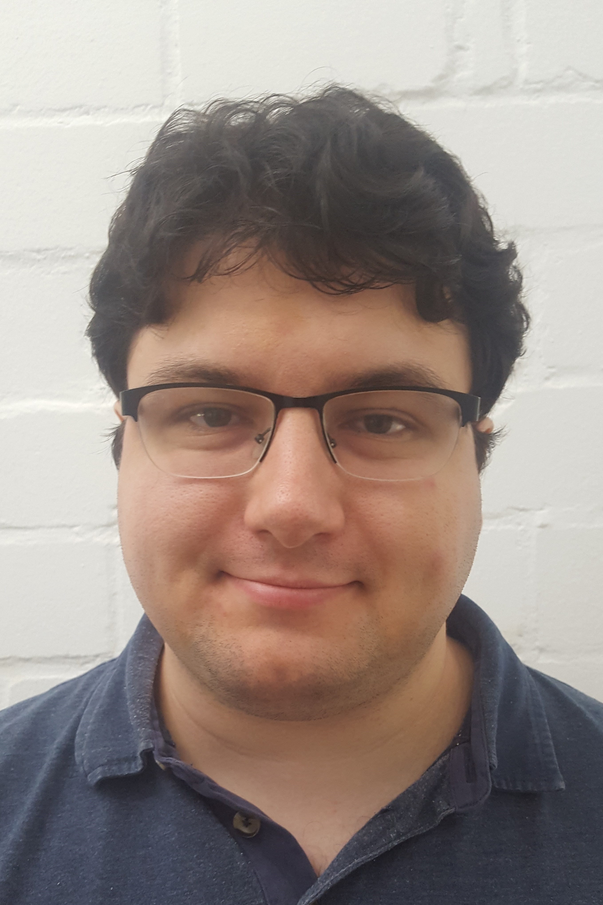

    

        

          
        

        

          Software Engineering 
          Department of Computer Science 3 
          RWTH Aachen University 
          Ahornstraße 55 
          D-52074 Aachen 
           
          +49 (241) 80-21343 
          <a href="mailto:schmalzing@se-rwth.de">schmalzing@se-rwth.de</a> 
           
          Room 4310
        

    

 


### Research Areas:

- Model-driven Engineering
- Component & Connector Architecture Description Languages
- Systems Engineering
- Software Product Lines



### Teaching:

- Seminar Software Engineering Seminar: A Journey into Software Language Workbenches (WS 2018)
- Project class Model-driven Engineering the Industry 4.0 (SS 2018)
- Seminar Software Engineering Seminar: Selected Topics in Software Engineering (SS 2018)
- Project class Model-driven Engineering the Industry 4.0 (SS 2018)
- Seminar Software Engineering Seminar: Selected Topics in Software Engineering (WS 2017)
- Project class Model-driven Engineering the Industry 4.0 (WS 2017)



### Publications:

  



### Recognition:

- [SoSyM 2019 Review Certificate SoSyM 2021 Review Certificate](https://www.se-rwth.de/staff/schmalzing/SoSyM.2021.ReviewCertificate.DS.pdf)

