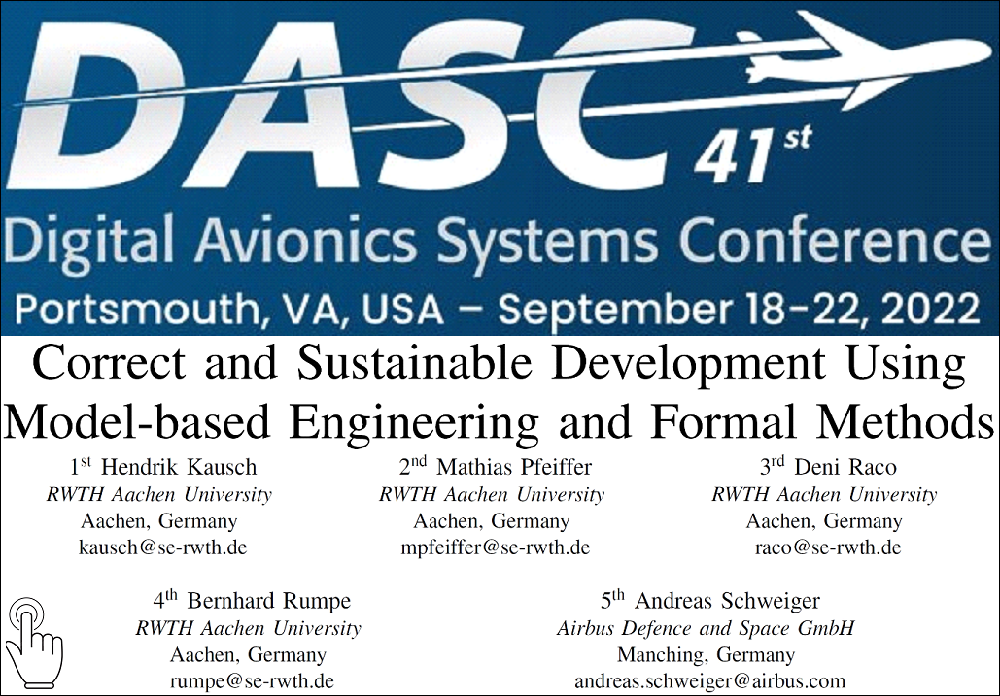

    

        

          
        

        

          Software Engineering 
          Department of Computer Science 3 
          RWTH Aachen University 
          Ahornstraße 55 
          D-52074 Aachen 
           
          tel. +49 (241) 80-21349 
          <a href="mailto:raco@se-rwth.de">raco@se-rwth.de</a> 
           
          Room 2227
        

    

 


### Teaching:

- Computer Science, Mathematics and Doctoral Studies at [RWTH Aachen University](https://en.wikipedia.org/wiki/RWTH_Aachen_University)
- Doctoral Grant from the [German Research Foundation](https://www.dfg.de/en/dfg_profile/mission/what_is_the_dfg/index.html) 
in the [Graduate Research Training Group](https://www.rwth-aachen.de/go/id/pmf/lidx/1) 
"Algorithmic Synthesis of Reactive and Discrete-Continuous Systems”
- [Entrepreneurship Grant](https://www.esf.de/portal/EN/Funding-period-2014-2020/ESF-Programmes/bmwi/exist.html) 
from the Federal Government and the European Union



### Publications:

  

