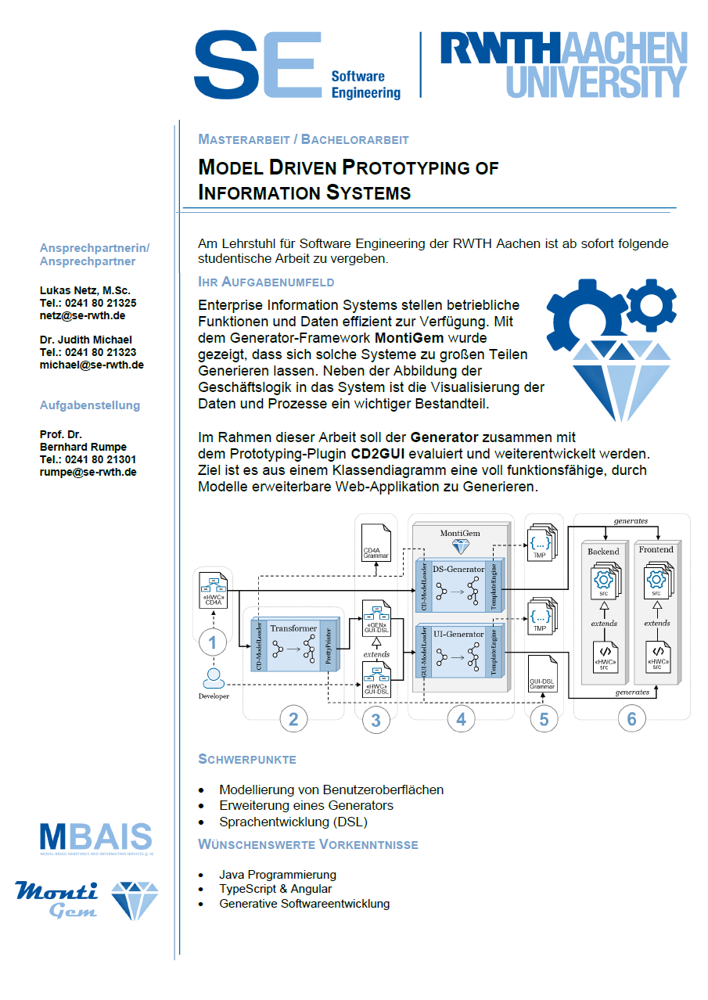
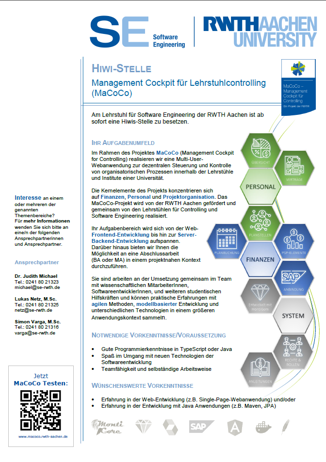
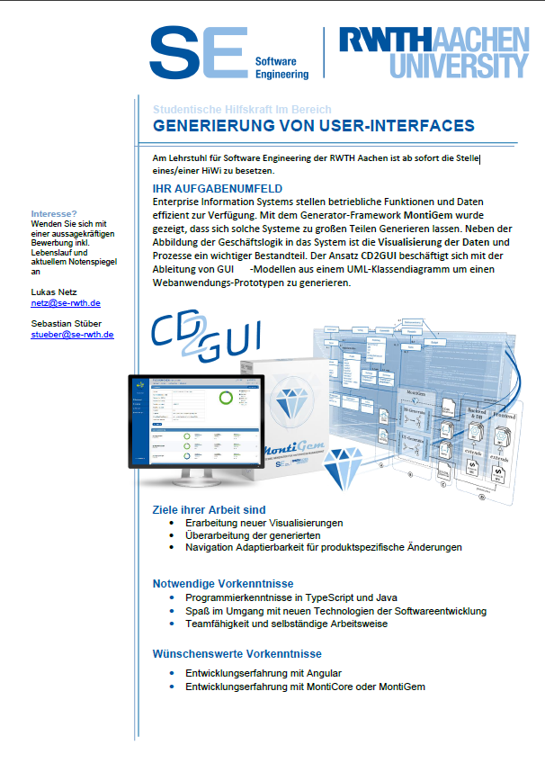

    

        

          
        

        

          Software Engineering 
          Department of Computer Science 3 
          RWTH Aachen University 
          Ahornstraße 55 
          D-52074 Aachen 
           
          +49 (241) 80-21325 
          <a href="mailto:netz@se-rwth.de">netz@se-rwth.de</a> 
           
          Room 4306
        

    

 


For matters concerning module pool organization (Modulangebotsorganisation) please use the following email address: 
<a href="mailto:modulangebot.informatik@fb1.rwth-aachen.de">modulangebot.informatik@fb1.rwth-aachen.de</a>



### Current topics for B.Sc. and M.Sc. theses & and HiWi Jobs

    

        

          
        

        

          
        

        

          
        

    

 
For further topics of the Software Engineering group, please have a look at our website.



### Teaching:

- Digitalization (SS2019) Explore and discuss digitalisation from different perspectives of informatics.

For the teaching agenda of the Software Engineering group, please have a look at our website.



### Publications:

  

