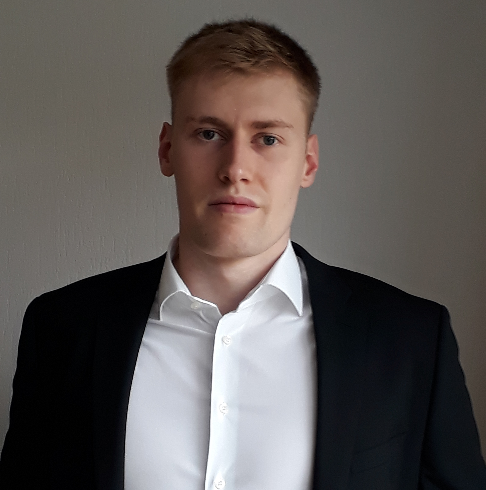

    

        

          
        

        

          Software Engineering 
          Department of Computer Science 3 
          RWTH Aachen University 
          Ahornstraße 55 
          D-52074 Aachen 
           
          +49 (241) 80-21351 
          <a href="mailto:stachon@se-rwth.de">stachon@se-rwth.de</a> 
           
          Raum 4221, Erweiterungsbau 1
        

    

 


### Research Areas:

- Semantics of Modelling Languages

