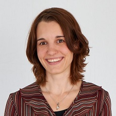

    

        

          
        

        

          Software Engineering 
          Department of Computer Science 3 
          RWTH Aachen University 
          Ahornstraße 55 
          D-52074 Aachen 
           
          +49 (241) 80-21354 
          <a href="mailto:schrader@se-rwth.de">schrader@se-rwth.de</a> 
           
          Room 4220
        

    

 


### Modulangebotsorganisation Informatik:

(!) For matters concerning module pool organization please contact
modulangebot.informatikatfb1.rwth-aachen.de
or visit [the GitLab-project "modulangebotsverwaltung"](https://git.rwth-aachen.de/modulangebot/modulangebotsverwaltung/tree/master).



### Teaching:

- 19W, Software Pioneers (S)
- 18W, Best Practices of Modern and Efficient Software Engineering (PS)
- 18W, Softwaretechnik (VL+Ü)
- 15S, Theory and Practice in Model-Based Software Engineering (S)
- 14W, Modellbasierte Softwareentwicklung (VL+Ü)
- 13W, Modellbasierte Softwareentwicklung (VL+Ü)