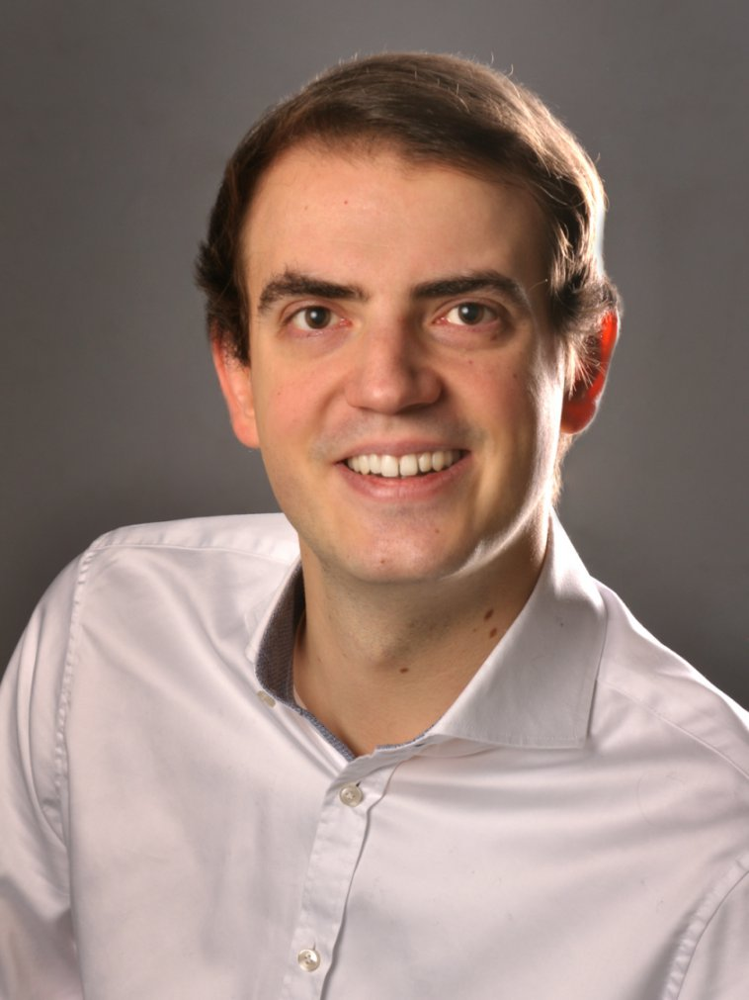

### Working Group

Modern vehicle systems highly depend on software distributed over multiple electrical control units and highly 
intertwined with the underlying hardware and mechanics. The tasks of this software range from vehicular core functionality 
such as engine or battery control to automated driver assistance and infotainment systems. The frontiers of this exciting 
field are being pushed daily towards fully autonomous intelligent driving systems. As the Automotive Software Engineering 
group we work closely with the automotive industry analyzing challenges in automotive software development processes, languages, 
and tools. Our mission is to research and deliver software development methodologies able to handle the complexity and 
heterogeneity of future cyber-physical transportation systems and to make it easier for automotive engineers to implement, 
test, and verify maintainable and extensible solutions. To achieve this goal our research is based on the following pillars:

- software development processes in engineering domains
- domain specific languages
- generative software engineering and testing
- simulation
- deep learning and data science.

Contact us for more information on our research as well as cooperations and know-how exchange or join us for a bachelor/master thesis or a PhD!

### Team Members

Get to know our automotive software engineering experts:

    

        

            
            Christian Kirchhof, M.Sc.
        

        

            
            Evgeny Kusmenko, M.Sc. (team leader)
        

        

            
            Imke Nachmann, M.Sc.
        

    

    

        

            
            Louis Wachtmeister, M.Sc.
        

        

            
            Matthias Markthaler, M.Sc.
        

        

            
            Vincent Bertram, M.Sc.
        

    

    

        

            
            Jonas Ritz, M.Sc.
        

    

We are always looking for motivated students eager to explore new technologies such as autonomous vehicles. Particularly, we offer exciting thesis topics in the fields of:

- Simulation/co-simulation
- Domain specific languages for embedded systems
- Deep Learning and Data Science
- Development processes in the automotive domain
- Generative test-driven development

### Research Partners

In ongoing and successfully finished research projects, we have collaborated with various partners from industry and 
academia including national and international automotive OEMs and suppliers.

### Our Most Important Languages and Tools

- MontiCore - language Workbench for DSLs
- EmbeddedMontiArc - component and connector language family
- MontiSim - simulation environment for cooperative vehicles
- MontiAnna - deep learning framework
