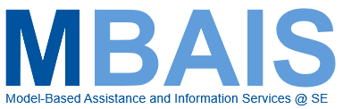
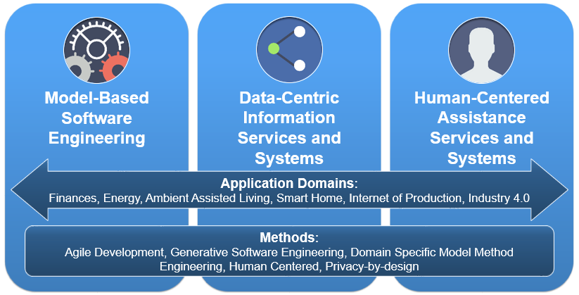
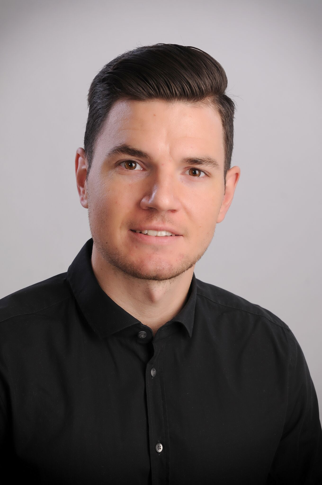
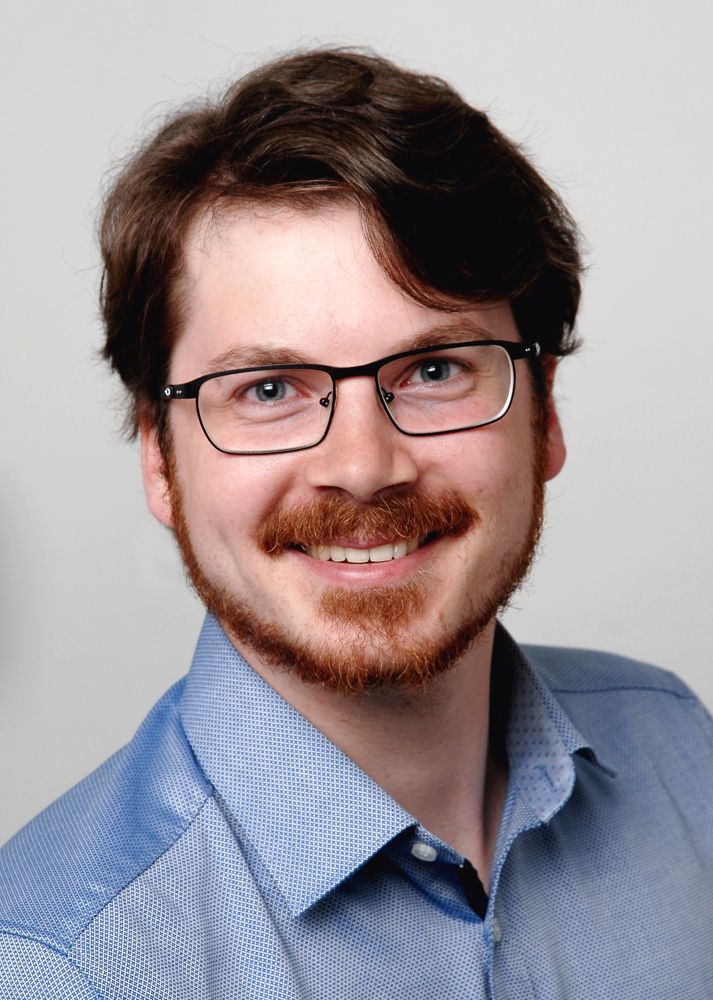
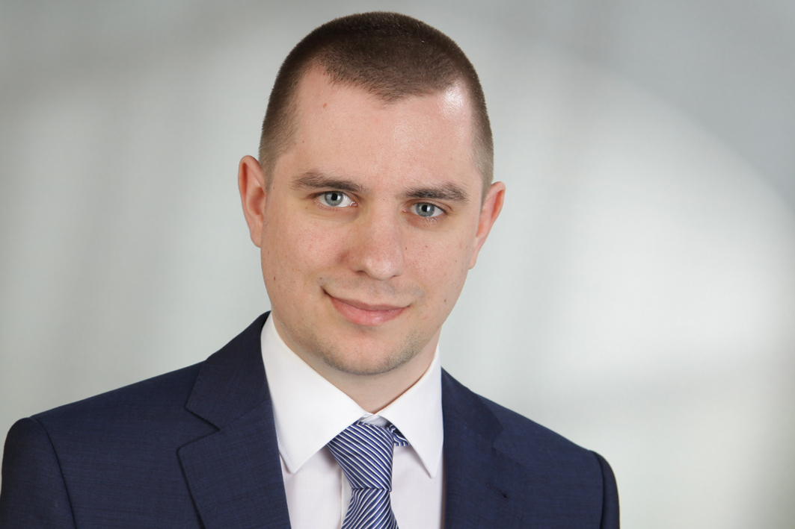

### Working Group

    

        

            Informatics as a research discipline must constantly face new challenges such 
            as heterogeneous information sources, growing amounts of structural and 
            behavioural data, and broad range of possible end-users. Thus, the need for 
            (a) assistive and (b) information services and systems grows. We meet these 
            challenges by using models and model-based software engineering as foundation 
            to develop data-centric information systems.
        

        

            
        

    

    

        

            
        

    

<h5 style="font-weight: bold"> Model-Based Software Engineering </h5>

Generating software is an important capability for a tooling 
infrastructure that successfully assists modeling in the development 
process (see ["Agile Model Based Software Engineering"](../topics/Agile-MBSE)). As 
every application domain has its own terms, relations, structure 
and behaviour, there is a need for developing different [Domain 
Specific Languages (DSLs)](../topics/Domain-Specific-Languages) for each domain and/or purpose. The automatic 
combination of models from a variety of DSLs ensures consistency 
(e.g. for front- and backend).

<h5 style="font-weight: bold"> Data-Centric Information Systems and Services </h5>

Systems and services for the representation of big amounts of data such 
as web-information portals are commonly used and their representation and 
system architecture highly depends on the domain in focus. Using generative 
methods accelerates the development process (see ["Generative 
Software Engineering"](../topics/Generative-SE)) and decreases development time, as changes of the 
models are easily passed on to the source code. We are demonstrating the 
practical application of this approach , e.g., in the [MaCoCo](../projects/MaCoCo) and InviDas 
project using the generator framework MontiGem.

<h5 style="font-weight: bold"> Human-Centered Assistance Systems and Services </h5>

A step further from informing users is to provide support to them. 
Supportive or also called assistive systems and services support human 
processes both, at work and in private life. It is again an emerging research 
field regarding the digital transformation of numerous application areas. 
Such assistance services are commonly embedded in a larger system architecture 
combining devices and resources, receiving data from sensors and communicate 
with functions and services. Model-based approaches improve the communication 
capabilities of these components and ensure consistency. Formal verification 
methods can be applied to a safety-critical subset of these components and 
their communication. Moreover, model-based approaches can be used to support 
privacy-by-design and eases human-centered development approaches.

<h5 style="font-weight: bold"> Application Domains </h5>

Assistance and Information Services are relevant in a variety of domains. 
Each of them with its own specifications, ideas and legal restrictions. 
Thus, it is important to strongly involve domain experts into the development 
process of such systems and services. This involvement can be supported by 
using MBSE: Prototypes and functionalities can be developed fast, changes 
can be easily handled, end users can provide feedback in an earlier development 
stage and feature requests can be implemented faster.

The group members already have experiences in the following domains:

- Ambient Assisted Living
- Controlling and Finances
- Energy
- Health
- Internet of Production (IoP)
- Internet of Things (IoT)
- Industry 4.0
- Smart Homes

### Research Questions

- What are further evolvement steps in theoretical foundations of model based code generation? How is it possible to combine different languages?
- What are the domain specific modelling languages and methods required for the creation of web information systems? How are these engineered, integrated, and reused? How does this translate to modeling tools, analysis, transformations, and code generators?
- What are the domain specific modelling languages and methods required for assistance services? What are the architectural components and how are they interrelated?
- How is it possible to ensure privacy-by-design of information and assistive systems in combination by using model-based software engineering? What aspects are relevant to be represented in privacy information portals to support privacy preservation for end users?

### Team Members 

Currently, the Model-Based Assistance and Information Services working group consists of:

    

        

            
            Judith Michael, Dr.
        

        

            
            Arvid Butting, M.Sc.
        

        

            
            Arkadii Gerasimov, M.Sc.
        

        

            
            Malte Heithoff, M.Sc.
        

    

    

        

            
            Steffen Hillemacher, M.Sc.
        

        

            
            Lukas Netz, M.Sc.
        

        

            
            Sebastian Stueber, M.Sc.
        

        

            
            Simon Varga, M.Sc.
        

    

<h5> Join the Team: </h5>

 Job offer: 
 [Modell-basierte und generative Entwicklung von Assistenzsystemen](https://www.se-rwth.de/jobs/WiMi.AssistiveSystems.pdf)

### Publications

Our research manifests in project results with large and small partners from industry and research, as well as in our publications. You can find our publications by topic:

<h5 style="font-weight: bold"> Modeling </h5>

- [Compositionality & Modularity of Models & Languages](/topics/Compositionality)
- [Modeling for Cyber-Physical Systems (CPS)](/topics/Cyber-Physical-Systems)
- [Generative Software Engineering](/topics/Generative-SE)
- [Modeling Software Architectures](/topics/Software-Architecture)
- [Variability & Software Product Lines (SPL)](/topics/Variability)

<h5 style="font-weight: bold"> Modeling Languages </h5>

- [Domain-Specific Languages (DSLs)](/topics/Domain-Specific-Languages)
- [Unified Modeling Language (UML)](/topics/Unified-Modeling-Language)
- [Software Language Engineering (SLE)](/topics/Language-Engineering)
- [Semantics of Modeling Languages](/topics/Semantics)

<h5 style="font-weight: bold"> Application Domains </h5>

- [Cloud Computing & Enterprise Information Systems](/topics/Cloud)
- [Energy-Management](/topics/Energy-Management)

<h5 style="font-weight: bold"> Our Most Important Software Tools </h5>

- [MontiCore - Language Workbench for DSLs](/topics/MontiCore)
- [UML/P - Executable Modeling with UML](/topics/UML-P)
