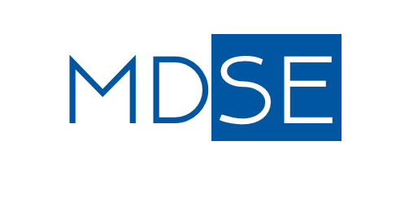
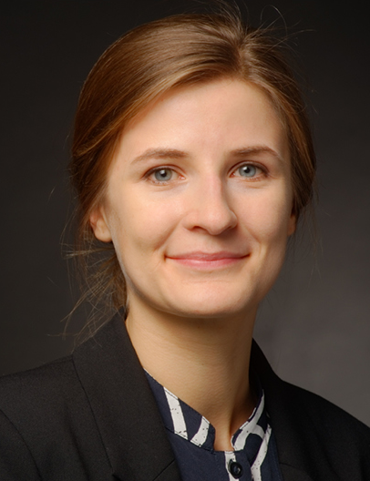

### Working Group

Engineering software for modern systems of systems demands 
integrating solutions from multiple domains. The successful 
deployment of automated vehicles, mobile robots or the smart
cyber-physical production systems of Industry 4.0 is impossible 
without integrating the modules developed by participating domain 
experts. As each domain features their own specific and optimized 
methods, tools, and languages, their successful integration is a 
crucial prerequisite for engineering future's systems of systems.

[Model-driven engineering](../research/Agile-MBSE) reduces the conceptual gap between the 
problem domains (such as navigation, grasping, or business process 
description) domains and the solution domains (programming) of 
discourse. [Modeling languages](../research/Domain-Specific-Languages) enables domain experts to describe 
solutions without facing the accidental complexities and 
idiosyncrasies of programming languages. For instance, employing 
an optimized modeling language to describe robotic assembly tasks 
liberates the assembly expert from handling pointers, exceptions, 
or networking otherwise encountered when programming the tasks 
using general-purpose programming languages (such as C++ or Java) 
instead. [Smart model](../research/Evolution) transformations and [code generators](../research/Generative-SE) embody 
such programming expertise and can ensure that translation of 
[domain-specific models](../research/Language-Engineering) conforms to state-of-the-art software 
engineering practices.



### Research Questions

- What are the modeling languages required for efficient systems engineering with domain experts? How are these engineered, integrated, and reused? How does this translate to modeling tools, analysis and synthesis techniques, transformations, and code generators?
- What are the theoretical foundations of systems engineering language integration and how can we exploit these to enable language components that support off-the-shelf reuse?
- How can we modularize language processing tooling along the language integration degrees of freedom to easily reusing the same tooling with different language combinations?
- How can we leverage architecture description languages to facilitate the separation of concerns required for efficient language integration and reuse?
- How does an agile process framework look like that optimally assists various kinds of development processes?



### Team Members

Currently, the model-driven systems engineering working group consists of:

    

        

            
            Nico Jansen, M.Sc.
        

        

            
            Judith Michael, Dr.
        

        

            
            Imke Nachmann, M.Sc.
        

    

    

        

            
            Jörg Christian Kirchhof, M.Sc.
        

        

            
            David Schmalzing, M.Sc.
        

        

            
            Louis Wachtmeister, M.Sc.
        

    



### Research Partners

In ongoing and successfully finished research projects, we have collaborated with various partners from industry and academy, including:

- BMW Group
- Bosch
- DSA Daten- und Systemtechnik GmbH
- FEV Europe GmbH
- Ford Motor Company
- Humboldt-Universität zu Berlin
- InSystems Automation GmbH
- Itemis AG
- pure-systems GmbH
- Robotics Equipment Corporation GmbH
- Siemens AG - Deutschland
- Symeo GmbH
- TU Braunschweig
- TU Clausthal
- TU München



### Publications

Our research manifests in project results with large and small 
partners from industry and research, as well as in our publications. 
We've arranged our publications by topic for your convenience below:

<h5 style="font-weight: bold"> Modeling </h5>

- [Compositionality & Modularity of Models & Languages](/research/Compositionality)
- [Modeling for Cyber-Physical Systems (CPS)](/research/Cyber-Physical-Systems)
- [Generative Software Engineering](/research/Generative-SE)
- [Modeling Software Architectures](/research/Software-Architecture)
- [Variability & Software Product Lines (SPL)](/research/Variability)

<h5 style="font-weight: bold"> Modeling Languages </h5>

- [Domain-Specific Languages (DSLs)](/research/Domain-Specific-Languages)
- [Unified Modeling Language (UML)](/research/Unified-Modeling-Language)
- [Software Language Engineering (SLE)](/research/Language-Engineering)
- [Semantics of Modeling Languages](/research/Semantics)

<h5 style="font-weight: bold"> Application Domains </h5>

- [Automotive](/research/Automotive)
- [Automated Driving & Intelligent Driver Assistance](/research/Autonomic-Driving)
- [Robotics Architectures and Tasks](/research/Robotics)

<h5 style="font-weight: bold"> Our Most Important Software Tools </h5>

- [MontiCore - Language Workbench for DSLs](/research/MontiCore)
- [UML/P - Executable Modeling with UML](/research/UML-P)
- [MontiArc - Architectural Modeling](/research/Software-Architecture)
