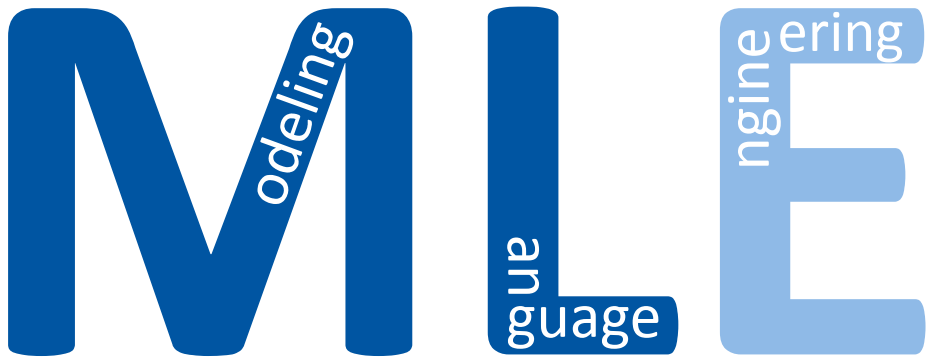
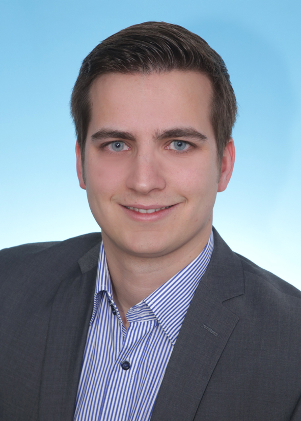

### Working Group

Model-driven engineering reduces the conceptual gap between the problem domains 
(such as navigation, grasping, or business process description) and the solution domains 
(programming). Modeling languages enables domain experts to describe solutions without 
facing the accidental complexities and idiosyncrasies of programming languages. For developing 
tailored domain-specific modeling languages, a well-suited and tailored language workbench is 
necessary. [MontiCore](https://monticore.github.io/monticore/) is the language workbench we developed over the last years. We constantly 
extend and improve MontiCore to explore new ways for developing modeling languages and tools such 
as language composition or derivation. Besides improving languages workbenches and their development,
methodologies, guidelines and pattern for modeling language engineering are essential to facilitate 
language engineering and improve the resulting modeling languages.



### Research Questions

- Which features or concepts need to be provided by a language workbench to facilitate modeling language engineering? Which reusable languages or language components are essential and how to modularize these to optimize their reuse capabilities?
- Besides typical model processing infrastructure such as parser or well-formedness checkers, which tooling such as transformation or semantic differencing capabilities facilitate model-driven engineering?
- What are the software languages required for efficient systems engineering with domain experts? How are software languages engineered, integrated, and reused? How does this translate to modeling tools, synthesis, analyses, transformations, and code generators?
- How can we leverage language derivation to facilitate the development of supporting languages such as transformation, variability or tagging languages?



### Team Members

Currently, the modeling language engineering working group consists of:

    

        

            
            Nico Jansen, M.Sc.
        

        

            
            Marita Breuer
        

        

            
            Rohit Gupta, M.Sc.
        

    

    

        

            
            Arvid Butting, M.Sc.
        

        

            
            Joel Charles, M.Sc.
        

        

            
            Max Stachon, M.Sc.
        

    

    

        

            
            Johannes Trageser, M. Eng.
        

        

            
            Steffi Schrader, M.A.
        

        

            
            Sebastian Stüber, M.Sc.
        

    



### Teaching

Our research activities and their results influence the courses we offer. In the past, research in model-driven engineering, software language engineering, and their application manifested in project classes and seminars:

- [Lecture - Softwaretechnik](https://www.se-rwth.de/teaching/ws1819/swt/) (Winter 18/19)
- [Lecture - Software Language Engineering](https://www.se-rwth.de/teaching/ss18/sle/) (Summer 18)
- [Lab Course - Statecharts in Action](https://www.se-rwth.de/teaching/ss18/lab/statecharts/) (Summer 18)
- [Lecture - Model-Based Software Engineering](https://www.se-rwth.de/teaching/ss17/mbse/) (Summer 17)
- [Lab Course - Model Transformation: the Heart and Soul of Model-Driven Software Development](https://www.se-rwth.de/teaching/ss16/lab_tf/) (Summer 16)
- [Lecture - Model-Based Software Engineering](https://www.se-rwth.de/teaching/ws1516/mbse/) (Winter 15/16)
- [Seminar - Selected Topics in Software Engineering](https://www.se-rwth.de/teaching/ws1516/seminar_se/) (Winter 15/16)
- [Lab Course - Eliminating Anti-Patterns in Domain Models](https://www.se-rwth.de/teaching/ss15/lab_tf/) (Summer 15)
- [Seminar - Selected Topics in Software Engineering](https://www.se-rwth.de/teaching/ws1415/seminar_se/) (Winter 14/15)
- [Lecture - Model-Based Software Engineering (IPEC Summer School)](https://www.se-rwth.de/teaching/ss14/mbse/) (Summer 14)
- [Lecture - Generative Software Engineering](https://www.se-rwth.de/teaching/ss14/gse/) (Summer 14)
- [Lecture - Model-Based Software Engineering](https://www.se-rwth.de/teaching/ws1314/mbse/) (Winter 13/14)
- [Proseminar - Best Practices of Modern and Efficient Software Engineering](https://www.se-rwth.de/teaching/ss13/proseminar/) (Summer 13)
- [Lecture - Model-Based Software Engineering](https://www.se-rwth.de/teaching/ws1213/mbse/) (Winter 12/13)

Additionally, we always have ideas for interesting Bachelor and Master theses in this context. Currently, we're looking for students willing to investigate the following research challenges.

- Modeling language development and modularization
- Model transformation based on the modelers vocabulary
- Semantics of modeling languages and models and their differences
- Methodologies and tutorials for using Language workbench



### Publications

Our research manifests in project results with large and small partners from industry and research, as well as in our publications. We've arranged our publications by topic for your convenience below:

<h5 style="font-weight: bold"> Modeling </h5>

- [Generative Software Engineering](/research/Generative-SE)
- [Modeling Software Architectures](/research/Software-Architecture)
- [Variability & Software Product Lines (SPL)](/research/Variability)
- [Modeling for Cyber-Physical Systems (CPS)](/research/Cyber-Physical-Systems)
- [Compositionality & Modularity of Models & Languages](/research/Compositionality)

<h5 style="font-weight: bold"> Modeling Languages </h5>

- [Domain-Specific Languages (DSLs)](/research/Domain-Specific-Languages)
- [Unified Modeling Language (UML)](/research/Unified-Modeling-Language)
- [Software Language Engineering (SLE)](/research/Language-Engineering)
- [Semantics of Modeling Languages](/research/Semantics)

<h5 style="font-weight: bold"> Application Domains </h5>

- [Automotive](/research/Automotive)
- [Automated Driving & Intelligent Driver Assistance](/research/Autonomic-Driving)
- [Robotics Architectures and Tasks](/research/Robotics)

<h5 style="font-weight: bold"> Our Most Important Software Tools </h5>

- [MontiCore - Language Workbench for DSLs](/research/MontiCore)
- [UML/P - Executable Modeling with UML](/research/UML-P)
- [MontiArc - Architectural Modeling](/research/Software-Architecture)
